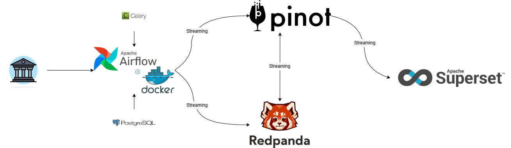
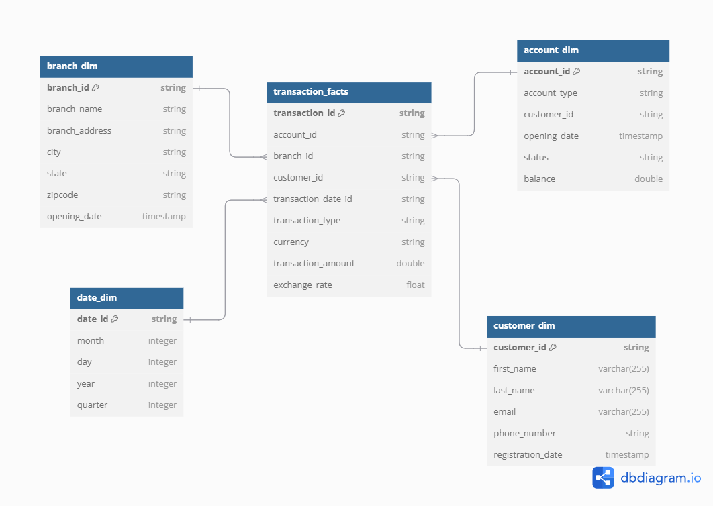

# Data Ingestion and Processing with Airflow, Superset, and Pinot

This project demonstrates a data ingestion and processing pipeline using Apache Airflow, Apache Superset, and Apache Pinot. The pipeline ingests dimension data into Pinot and visualizes it using Superset.

## Table of Contents

- [Prerequisites](#prerequisites)
- [Project Structure](#project-structure)
- [Project Architecture](#project-architecture)
- [Setup](#setup)
- [Configuration](#configuration)
- [Running the Project](#running-the-project)
- [Airflow DAGs](#airflow-dags)
- [Superset Configuration](#superset-configuration)
- [Pinot Configuration](#pinot-configuration)
- [Troubleshooting](#troubleshooting)

## Prerequisites

- Docker and Docker Compose
- Python 3.8+
- Apache Airflow
- Apache Superset
- Apache Pinot

## Project Structure
Sure, here is a detailed `README.md` file based on the architecture and the steps you have taken so far:

```
.
├── dags/
│   ├── tables/
│   ├── schemas/
│   ├── account_dim_generator.py
│   ├── branch_dim_generator.py
│   ├── customer_dim_generator.py
│   ├── schema_dag.py
│   ├── table_dag.py
│   ├── loader_dag.py
│   └── transaction_facts_generator.py
├── plugins/
│   ├── kafka_operator.py
│   ├── pinot_table_operator.py
│   └── pinot_schema_operator.py
├── superset/
│   ├── Dockerfile.py
│   ├── superset-init.sh
│   └── superset_config.py
├── .env
├── requirements.txt
├── docker-compose.yml
└── README.md
```

## Project Architecture
Here is the architecture of the project:


The schema for dimensional tables and fact table are defined as followed:


## Setup

1. **Clone the repository**:
   ```sh
   git clone https://github.com/MinhTran1506/realtime_data_warehouse.git
   cd realtime_data_warehouse
   ```

2. **Create and activate Python virtual environement**:
    ```sh
    python -m venv .venv
    .venv/Scripts/activate
    ```

2. **Install Python dependencies**:
   ```sh
   pip install -r requirements.txt
   ```

3. **Install Docker and Docker Compose**:
   Follow the instructions on the [Docker website](https://docs.docker.com/get-docker/) to install Docker and Docker Compose.

## Configuration

1. **Environment Variables**:
   Create a `.env` file in the root directory with the following content:
   ```properties
   AIRFLOW_UID=1000
   SECRET_KEY=your_secret_key
   ADMIN_PASSWORD=your_admin_password_here
   ```

2. **Superset Configuration**:
   Ensure that `superset/superset_config.py` loads the environment variables correctly:
   ```python
   from dotenv import load_dotenv
   import os

   # Load environment variables from .env file
   load_dotenv()

   # Get the secret key from the environment variables
   SECRET_KEY = os.getenv('SECRET_KEY')

   if not SECRET_KEY:
       raise RuntimeError("A secret key is required to use CSRF.")

   FEATURE_FLAGS = {
       "ENABLE_TEMPLATE_PROCESSING": True,
   }

   ENABLE_PROXY_FIX = True
   ```

3. **Docker Compose Configuration**:
   Ensure that `docker-compose.yml` uses the environment variables correctly:
   ```yaml
   version: '3.8'

   services:
     admin:
       image: your_admin_image
       environment:
         - ADMIN_PASSWORD=${ADMIN_PASSWORD}
       # Other configurations for the admin service
   ```

## Running the Project

1. **Start Docker Compose**:
   ```sh
   docker-compose up -d
   ```

2. **Access Airflow**:
   Open your browser and go to `http://localhost:8080` to access the Airflow web interface.

3. **Access Superset**:
   Open your browser and go to `http://localhost:8088` to access the Superset web interface.

## Airflow DAGs

1. **Dimension Data Generators**:
   - `account_dim_generator.py`: Generates random account dimension data.
   - `branch_dim_generator.py`: Generates random branch dimension data.
   - `customer_dim_generator.py`: Generates random customer dimension data.

2. **Loader DAG**:
   - `loader_dag.py`: Ingests dimension data into Pinot using `BashOperator` and `curl` commands.

3. **Transaction Facts Generator**:
   - `transaction_facts_generator.py`: Generates random transaction facts data and sends it to Kafka.

## Superset Configuration

1. **Superset Configuration File**:
   - `superset/superset_config.py`: Configures Superset to use the secret key from the environment variables.

## Pinot Configuration

1. **Pinot Schema and Table Configurations**:
   - `account_dim_schema.json`: Defines the schema for the account dimension table.
   - `branch_dim.json`: Defines the table configuration for the branch dimension table.
   - `customer_dim.json`: Defines the table configuration for the customer dimension table.
   - `transaction_facts.json`: Defines the table configuration for the transaction facts table.

## Troubleshooting

1. **Common Issues**:
   - Ensure that the `.env` file is correctly formatted and located in the root directory.
   - Verify that Docker and Docker Compose are installed and running.
   - Check the Airflow and Superset logs for any errors.

2. **Runtime Errors**:
   - If you encounter a `RuntimeError` related to the secret key, ensure that the `SECRET_KEY` is correctly set in the `.env` file and loaded in `superset/superset_config.py`.

3. **Docker Issues**:
   - If Docker containers fail to start, check the Docker Compose logs for any errors and ensure that the environment variables are correctly set.

## Conclusion

This project demonstrates a complete data ingestion and processing pipeline using Apache Airflow, Redpanda, Apache Superset, and Apache Pinot. By following the setup and configuration steps, you can easily deploy and run the pipeline to ingest and visualize dimension data.

